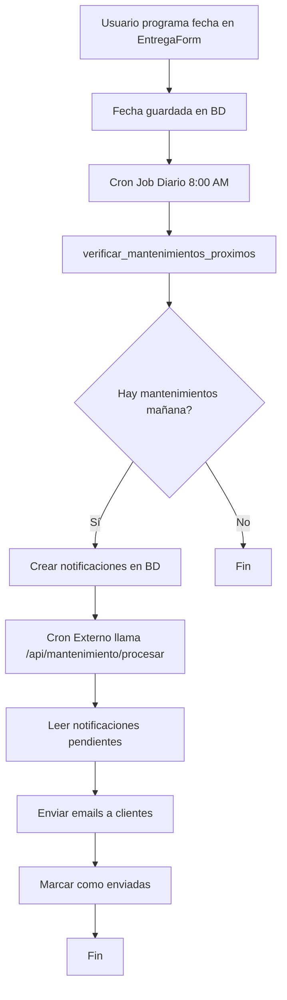

# 🚀 Quick Start - Sistema de Notificaciones de Mantenimiento

## ✅ ¿Qué hace este sistema?

Envía **automáticamente** un correo electrónico a los clientes **un día antes** de la fecha programada para el mantenimiento de su equipo.

## 📦 Archivos Creados

### SQL (Base de Datos)
```
sql/mantenimiento/
├── 01_crear_funciones_mantenimiento.sql   ← Funciones SQL + columna nueva
├── 02_configurar_cron_job.sql             ← Job automático diario
└── README.md                              ← Documentación completa
```

### Backend (API)
```
src/
├── app/api/
│   ├── email/send/route.ts                ← ✏️ Actualizado (nuevo tipo de email)
│   └── mantenimiento/procesar/route.ts    ← ✨ Nuevo endpoint
└── lib/
    ├── email/
    │   ├── emailService.ts                ← ✏️ Actualizado (nueva función)
    │   └── templates.ts                   ← ✏️ Actualizado (nuevo template)
    └── services/
        └── mantenimientoNotificationService.ts  ← ✨ Servicio nuevo
```

### Frontend
```
src/components/paneladmin/ordenes/
└── EntregaForm.tsx                        ← ✏️ Actualizado (guarda fecha)
```

### Automatización
```
.github/workflows/
└── mantenimiento-cron.yml                 ← ✨ GitHub Actions (opcional)
```

## 🏃 Pasos Rápidos (5 minutos)

### 1️⃣ Ejecutar en Supabase (Dashboard)

**a) Habilitar extensión:**
- Dashboard > Database > Extensions
- Buscar "pg_cron" → Enable

**b) Ejecutar scripts SQL:**
- Dashboard > SQL Editor
- Copiar y ejecutar `01_crear_funciones_mantenimiento.sql`
- Copiar y ejecutar `02_configurar_cron_job.sql`

### 2️⃣ Configurar Variables de Entorno

Agregar a `.env.local`:

```env
# Token de seguridad para el cron (genera uno aleatorio)
CRON_SECRET_TOKEN=tu-token-secreto-muy-largo-y-aleatorio

# URL de tu app (para llamadas internas)
NEXT_PUBLIC_APP_URL=https://tu-sitio.com
```

### 3️⃣ Configurar Cron Externo (Envío de Emails)

**Opción A: cron-job.org (Más fácil, 2 minutos)**

1. Crear cuenta en https://cron-job.org
2. Nuevo Cronjob:
   - Título: "Mantenimiento Team Service"
   - URL: `https://tu-sitio.com/api/mantenimiento/procesar`
   - Schedule: `Every day at 8:00` (ajustar a tu hora)
   - HTTP Method: GET
   - Request Headers:
     ```
     Authorization: Bearer tu-token-secreto
     ```

**Opción B: GitHub Actions (Ya incluido)**

1. Subir el archivo `.github/workflows/mantenimiento-cron.yml`
2. En GitHub: Settings > Secrets > New repository secret
   - `APP_URL` = https://tu-sitio.com
   - `CRON_SECRET_TOKEN` = tu-token-secreto

### 4️⃣ Probar el Sistema

**Desde Supabase SQL Editor:**

```sql
-- Configurar una orden de prueba para mañana
UPDATE ordenes 
SET fecha_proximo_mantenimiento = CURRENT_DATE + INTERVAL '1 day',
    estado_actual = 'Entregado'
WHERE codigo = 'TS-2024-XXX';  -- Cambiar por código real

-- Ejecutar manualmente
SELECT * FROM verificar_mantenimientos_proximos();

-- Ver notificaciones creadas
SELECT * FROM notificaciones 
WHERE referencia_tipo = 'orden_mantenimiento' 
ORDER BY created_at DESC 
LIMIT 5;
```

**Desde el navegador (prueba de email):**

```javascript
// Abrir consola del navegador (F12)
fetch('/api/mantenimiento/procesar', {
  headers: { 'Authorization': 'Bearer tu-token-secreto' }
})
.then(r => r.json())
.then(console.log);
```

## 🎯 Flujo del Sistema



## 📧 Ejemplo de Email

El cliente recibirá un email profesional con:
- 🔔 Título: "Recordatorio de Mantenimiento"
- 📅 Fecha del mantenimiento
- 🔧 Descripción del equipo
- 📍 Información de contacto
- ⚙️ Beneficios del mantenimiento preventivo
- 📞 Botón para agendar

## 🐛 Troubleshooting Rápido

| Problema | Solución |
|----------|----------|
| Emails no llegan | Verifica `EMAIL_USER` y `EMAIL_PASS` en `.env` |
| Error 401 en endpoint | Revisa `CRON_SECRET_TOKEN` coincida |
| Cron no ejecuta | Verifica `pg_cron` esté habilitado |
| No se crean notificaciones | Revisa que `estado_actual = 'Entregado'` |

## 📊 Monitoreo

**Ver notificaciones recientes:**
```sql
SELECT 
  datos_adicionales->>'orden_codigo' as orden,
  datos_adicionales->>'cliente_nombre' as cliente,
  (datos_adicionales->>'email_enviado')::boolean as enviado,
  created_at
FROM notificaciones 
WHERE referencia_tipo = 'orden_mantenimiento'
ORDER BY created_at DESC 
LIMIT 10;
```

**Ver historial de cron:**
```sql
SELECT 
  jobname, 
  start_time, 
  end_time, 
  status,
  return_message
FROM cron.job_run_details 
WHERE jobid = (SELECT jobid FROM cron.job WHERE jobname = 'verificar_mantenimientos_diario')
ORDER BY start_time DESC 
LIMIT 10;
```

## 🎨 Personalización

### Cambiar hora de ejecución
Editar `02_configurar_cron_job.sql` línea 43:
```sql
'0 13 * * *'  -- 8AM Colombia (UTC-5)
```

### Cambiar contenido del email
Editar `src/lib/email/templates.ts` → función `templateRecordatorioMantenimiento()`

### Cambiar diseño del email
Editar `src/lib/email/templates.ts` → variable `baseStyles`

## 📚 Documentación Completa

Ver `sql/mantenimiento/README.md` para:
- Explicación detallada de cada componente
- Opciones avanzadas de configuración
- Solución de problemas extendida
- Próximas funcionalidades

## ✨ Características

- ✅ Totalmente automático
- ✅ Notificaciones en la BD
- ✅ Emails HTML profesionales
- ✅ Sistema de reintentos
- ✅ Logs detallados
- ✅ Seguro (con token)
- ✅ Escalable
- ✅ Fácil de monitorear

## 🚀 Next Steps

1. ✅ Ejecutar scripts SQL
2. ✅ Configurar variables de entorno
3. ✅ Configurar cron externo
4. ✅ Probar con orden de prueba
5. ✅ Verificar email recibido
6. ✅ Monitorear primeros días

---

**¿Necesitas ayuda?** Revisa `sql/mantenimiento/README.md` para documentación completa.

**Team Service Costa S.A.S.** - Sistema de Gestión de Mantenimientos v1.0
